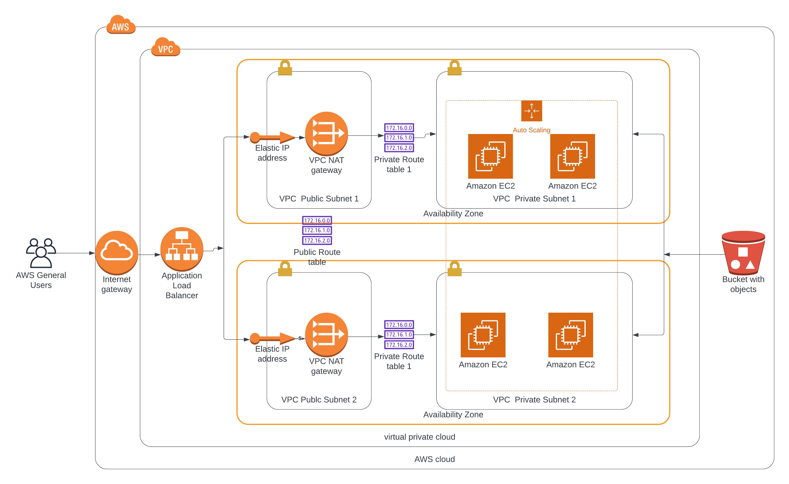

# HighAvailabilityMeow
A high-availability web app using Cloud Formation

> :warning: **Warning**
> **If you encountered this repo while peacefully surffing the internet**: Just ignore it , it's just a project submission for a Udacity nanodegree in DevOps, and I don't think it would benefit you in anyway, have a lovely day :handshake:.

## Architecture Diagram

## Content

In the repo you will find the following:

- The **`CloudFormation`** folder contain all the required file to deploy the app infrastructure with the needed parameters.
    - The **`networkInfra`** responsible for deploying the network infrastructure.
    - The **`s3bucket`** responsible for deploying any s3bucket with IAM role.
    - The **`serversInfra`** responsible for deploying the needed servers with autoscaling , load balancing and security groups.
- The **`docs`** folder contain the architecture diagram and a file that we will use with the S3 bucket.
- The **`deploy-stack.sh`** script that help you in creating/updating or deleting the cloudformation stack

## Deployment Process

- Deploy the network infrastructure by running the following command **`./deploy-stack.sh create udacityDemo-network networkInfra us-east-1`**
- After the network infrastructure finishes, we need to deploy the s3bucket first by running this command **`./deploy-stack.sh create udacityDemo-bucket s3bucket us-east-1`**, but first you may need to change the bucket name from the **`s3bucket.json`** parameters file.
- Upload the **`MeowWebsite.zip`** file in the **`./docs`** to the created bucket, you can use this command **`aws s3 cp ./docs/MeowWebsite.zip s3://${BucketName}/`** for example in my case it will be **`aws s3 cp ./docs/MeowWebsite.zip s3://udacity-090403035262-bucket/`**
- After it finishes we can deploy the servers by rerunning the following command **`./deploy-stack.sh create udacityDemo-servers serversInfra us-east-1`**

- After it finishes you can open up the website url "you can find the link in the output of the udacityDemo-servers stack "

## Website URL

**[Meow Website](http://udaci-webap-1bk4moxtog9wf-1425865623.us-east-1.elb.amazonaws.com/)**

> **_NOTE:_** The website url will not be available after the submission.

## Notes & Considerations

- You can use the **`deploy-stack.sh`** script also to update or delete stacks as following:
    - To **`update`** write **`update`** instead of **`create`** for example **`./deploy-stack.sh update udacityDemo-network networkInfra us-east-1`**
    - To **`update`** write **`delete`** instead of **`create`** with only the stack name for example **`./deploy-stack.sh delete udacityDemo-network`**

- In the **`serversInfra.yaml`** file :
    - The **`JumpBox`** resource with its **`JumpBoxSecGroup`** resource are used for testing only and should be removed from the stack after that.
    - Also the **`SSHKeyPair`** property in the **`InstancesLaunchTemplate`** resource and the open port 22 of the **`SecurityGroupIngress`** property in the **`InstancesSecGroup`** resource are used for testing only and should be removed from the stack after that.
    - If you want to check the **`JumpBox`** you need to update the **`SSHKeyPair`** parameter from the **`serversInfra.json`** parameters file with the appropriate key pair.